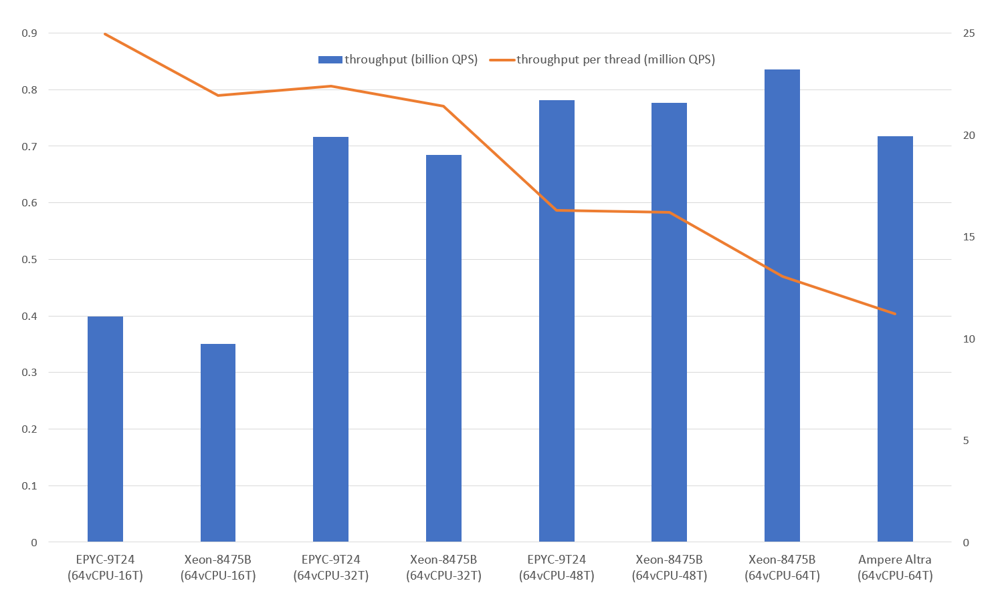

# 静态组相联Hash表
为诸如大规模DNN稀疏特征查询等需要极致性能的场景优化，可提供单机亿级QPS。

### 关键特性
* 极致的读取性能
* 较小的空间开销（每项1字节+6.25%的数据大小）
* 在线不可写
* 要求CPU支持小端非对齐内存访问（X86、ARM、RISC-V等）

### 其他解决方案
* [紧凑版](https://github.com/PeterRK/fastCHD)
* [可写版](https://github.com/PeterRK/estuary)

---
[【中文】](README-CN.md) [【英文】](README.md)
